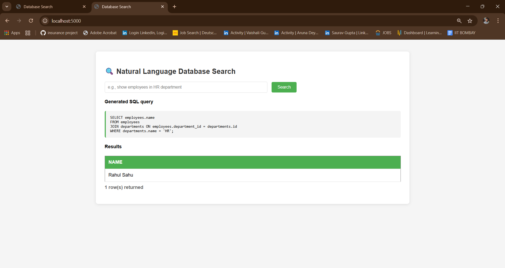

# 🔍 Natural Language Database Search

A Flask web application that converts natural language queries into SQL using AI (Ollama + Mistral) and executes them against a PostgreSQL database.

## ✨ Features

-  Ask database questions in plain English (Natural Language)
-  AI-powered SQL generation with Ollama (Mistral)
-  Secure - only SELECT queries allowed No Delete, Drop, Update
-  Clean & simple responsive web interface
-  Vector search support with pgvector
-  Fully Dockerized

## 🏷️ Screenshots & video link


## 🚀 YouTube video Link
👉  Click on Thumbnail [](https://www.youtube.com/watch?v=7wg4yJtkMz4&t=8s)

## 🚀 Quick Start

### Using Docker

```bash
# Clone the repo
git clone https://github.com/mohitkumarsahu/nl-sql-search.git
cd nl-sql-search

# Start all services
docker-compose up -d

# Pull Mistral model
docker exec -it ollama_service ollama pull mistral

# Access at http://localhost:5000
```

### Local Setup

```bash
# Install dependencies
pip install -r requirements.txt

# Setup PostgreSQL database
createdb company
psql company < sql_tables/schema.sql
psql company < sql_tables/sample_data.sql

# Install and run Ollama
curl -fsSL https://ollama.com/install.sh | sh
ollama pull mistral

# Run the app
python app.py
```

## 📁 Project Structure

```
NL_SQL_search/
├── app.py                      # Main Flask application
├── Dockerfile                  # Docker configuration
├── docker-compose.yml          # Multi-container setup
├── requirements.txt            # Python dependencies
├── ScreenShots/                # Screenshots
│   ├── ss.png          
│   ├── nl_sql_video.mp4
├── backend_files/              # Core logic
│   ├── db_execute.py          # SQL execution
│   ├── embeddings.py          # Vector embeddings
│   └── llm_to_sql.py          # NL to SQL converter
│
├── database_connection/        # Database utilities
│   └── db.py                  # PostgreSQL connection
│
├── sql_tables/                 # Database schemas
│   ├── schema.sql             # Table definitions
│   └── sample_data.sql        # Sample data
│
└── templates/                  # Frontend
    └── index.html             # Web interface
```

## 💡 Usage Examples

Ask questions like:
- "Show all employees in HR department"
- "List products with price greater than 50000"
- "Find employees earning more than 60000"
- "Show orders placed in January 2025"

## 🗄️ Database Schema

- **departments** (id, name)
- **employees** (id, name, department_id, email, salary)
- **products** (id, name, price, embedding)
- **orders** (id, customer_name, employee_id, order_total, order_date)

## ⚙️ Configuration


## 🔧 Troubleshooting

**Ollama model not found:**
```bash
docker exec -it ollama_service ollama pull mistral
```

**Database connection failed:**
```bash
docker-compose logs db
docker-compose restart db
```

**View app logs:**
```bash
docker-compose logs -f app
```

## 📚 Learning Outcomes

**Technical Skills Gained:**
- Flask web development with templates and form handling
- LLM integration (Ollama/Mistral) for NL to SQL conversion
- PostgreSQL with pgvector extension for vector search
- Docker containerization
- Security practices (SQL injection prevention, input validation)

**Key Takeaways:**
- How AI/LLMs enhance traditional applications
- Importance of containerization for deployment
- Real-world NLP application in database querying

## 🚀 Future Improvements

**Technical Enhancements:**
- [ ] User authentication and query history
- [ ] Export results (CSV, Excel, PDF)
- [ ] Data visualization with charts and graphs
- [ ] Support for multiple databases (MySQL, MongoDB)
- [ ] Query optimization suggestions
- [ ] Voice input for queries
- [ ] Advanced analytics dashboard
- [ ] Unit and integration tests
- [ ] CI/CD pipeline implementation
- [ ] Monitoring and logging improvements
- [ ] More bigger and robust model to generate perfect queries.


## 🙏 Acknowledgments

Built with Flask, Ollama, PostgreSQL, pgvector, and Mistral AI

---

**Made by Mohit Kumar Sahu ❤️**

⭐ Star this repo if you find it useful!
